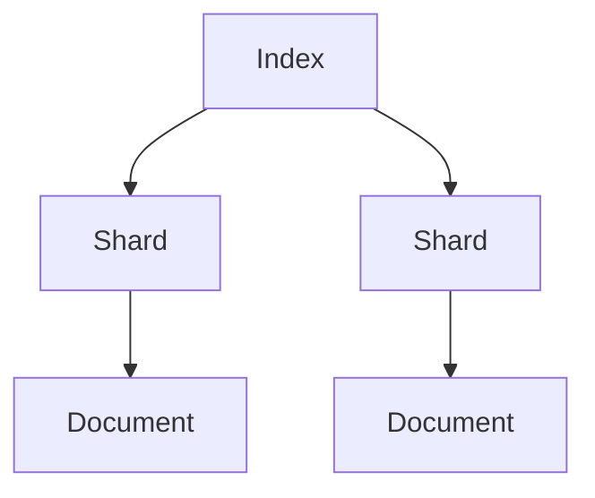
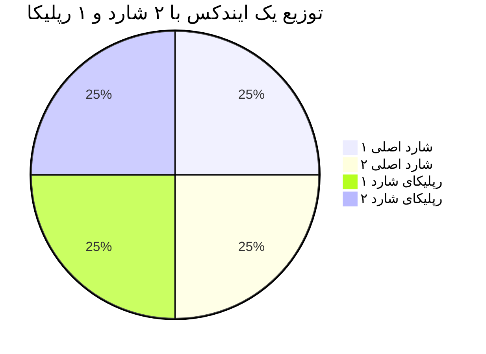

## مفاهیم شاخص گذاری - Indexing Concepts
### 📔 ایندکس (Index) 
ایندکس یه جور فهرست یا ساختار منظمه که کمک می‌کنه توی داده‌ها سریع‌تر چیزی که می‌خوایم رو پیدا کنیم. مثل فهرست آخر یه کتاب که بهمون می‌گه یه موضوع خاص توی کدوم صفحه‌هاست.

**مثال ملموس:**  
فرض کنید یه کتاب آشپزی دارید با ۲۰۰ صفحه. می‌خواید دستور پخت "کیک شکلاتی" رو پیدا کنید.
بدون فهرست، باید کل کتاب رو صفحه به صفحه بخونید تا پیداش کنید.
اما اگه یه فهرست (ایندکس) باشه که بگه "کیک شکلاتی: صفحه ۴۵ و ۱۲۰"، مستقیم می‌رید سراغ اون صفحه‌ها.
توی دنیای داده‌ها هم ایندکس همین کار رو می‌کنه: جستجو رو سریع‌تر می‌کنه.

**تعریف علمی‌تر:**  
توی دیتابیس‌ها یا موتورهای جستجو، ایندکس یه ساختار داده‌ست (مثل جدول یا لیست) که به سیستم می‌گه اطلاعات خاص کجا ذخیره شدن، بدون اینکه نیاز باشه کل داده‌ها رو اسکن کنه.

---

### 📒 ایندکسینگ (Indexing)
ایندکسینگ یعنی فرآیند ساختن اون فهرست یا ایندکس. وقتی داده‌ها رو ایندکس می‌کنیم، داریم اونا رو مرتب و سازمان‌دهی می‌کنیم که بعداً بتونیم سریع‌تر پیداشون کنیم.

**مثال ملموس:**  
فرض کنید یه دفترچه تلفن دارید با اسامی: علی، زهرا، بهرام، سارا. اگه بخواید "زهرا" رو پیدا کنید و اسما مرتب نباشن، باید تک‌تک نگاه کنید.
حالا اگه این اسما رو به ترتیب حروف الفبا مرتب کنید (علی، بهرام، زهرا، سارا)، این کار می‌شه یه نوع ساده از ایندکسینگ.
بعدش پیدا کردن "زهرا" خیلی سریع‌تره چون می‌دونید توی بخش "ز" باید دنبالش بگردید.

**تعریف علمی‌تر:**  
توی سیستم‌های کامپیوتری، ایندکسینگ یعنی اسکن کردن داده‌ها، پیدا کردن الگوها یا کلیدها (مثل کلمات یا مقادیر خاص)، و ذخیره کردن این اطلاعات توی یه ساختار منظم که بعداً بشه ازش برای جستجو استفاده کرد.

---


### 📓 اینورتد ایندکس (Inverted Index) 
اینورتد ایندکس یه نوع خاص از ایندکسه که به جای اینکه بگه "هر سند چه چیزایی داره(کل : جز ها)"، می‌گه "هر چیز توی چه سندهایی هست(جز:کدام کل ها)".
مثل اینه که فهرست کتاب رو برعکس کنید: به جای "صفحه ۱: سیب و پرتقال"، می‌گه "سیب: صفحه ۱ و ۳".

**مثال ملموس:**  
فرض کنید سه تا یادداشت دارید:  
- یادداشت ۱: "من سیب دوست دارم"  
- یادداشت ۲: "سیب قرمز خوشمزه‌ست"  
- یادداشت ۳: "پرتقال ترش و خوبه"  

یه ایندکس معمولی می‌گه:  
- یادداشت ۱: من، سیب، دوست، دارم  
- یادداشت ۲: سیب، قرمز، خوشمزه‌ست  
- یادداشت ۳: پرتقال، ترش، خوبه  

اما اینورتد ایندکس می‌گه:  
- **سیب**: یادداشت ۱، یادداشت ۲  
- **قرمز**: یادداشت ۲  
- **پرتقال**: یادداشت ۳  
- **دوست**: یادداشت ۱  

حالا اگه بخواید یادداشت‌هایی که "سیب" دارن رو پیدا کنید، مستقیم می‌رید سراغ فهرست "سیب" و می‌بینید توی یادداشت ۱ و ۲ هست. این کار خیلی سریع‌تر از خوندن تک‌تک یادداشت‌هاست.

**تعریف علمی‌تر:**  
اینورتد ایندکس یه ساختار داده‌ست که توی اون، هر کلمه یا کلید (term) به لیستی از شناسه‌های سندهایی که اون کلمه توشون هست، مپ می‌شه. این روش برای جستجوی متنی (مثل سرچ توی گوگل) خیلی بهینه‌ست.

---

#### اینورتد ایندکس کجاها کاربرد داره؟

اینورتد ایندکس توی هر سیستمی که نیاز به جستجوی سریع توی متن داشته باشه، استفاده می‌شه. چند مثال:  

**موتورهای جستجو (مثل گوگل):**  
   - وقتی توی گوگل سرچ می‌کنید "بهترین رستوران تهران"، اینورتد ایندکس به گوگل می‌گه کدوم صفحه‌ها این کلمات رو دارن و کجا هم‌پوشانی دارن.

**سیستم Elasticsearch و سیستم‌های لاگ:**  
   - فرض کنید یه شرکت لاگ‌های سرورش رو توی Elasticsearch ذخیره کرده.
   - اگه بخواد خطاهایی که کلمه "error" توشون هست رو پیدا کنه، اینورتد ایندکس سریع نشون می‌ده این کلمه توی کدوم لاگ‌ها بوده.

**فروشگاه‌های آنلاین:**  
   - توی دیجی‌کالا سرچ می‌کنید "لپ‌تاپ مشکی"، اینورتد ایندکس توضیحات محصولات رو بررسی می‌کنه و سریع محصولاتی که این کلمات توشون هست رو پیدا می‌کنه.

**کتابخونه‌های دیجیتال:**  
   - توی یه آرشیو مقالات، دنبال مقالاتی می‌گردید که "هوش مصنوعی" توشون باشه. اینورتد ایندکس سریع مقالات مرتبط رو پیدا می‌کنه.
 
#### ➕ مزیت های Inverted Index:

- **سرعت:** جستجو توی حجم عظیم داده‌ها رو خیلی سریع می‌کنه.  
- **انعطاف‌پذیری:** می‌تونه جستجوهای پیچیده (مثل چند کلمه‌ای یا با غلط املایی) رو پشتیبانی کنه.  
- **مقیاس‌پذیری:** توی سیستم‌های بزرگ مثل Elasticsearch، به راحتی با داده‌های زیاد کنار میاد.


**مثال** :
    
| کلمه    | سندها       |
|--------|------------|
| خطا    | 1, 3, 5    |
| Timeout| 2, 5       |

   

#### 🗒️ خلاصه به زبان خیلی ساده

- **ایندکس:** مثل فهرست کتابه، کمک می‌کنه سریع چیزی که می‌خوای رو پیدا کنی.  
- **ایندکسینگ:** ساختن اون فهرست، یعنی مرتب کردن داده‌ها برای جستجوی سریع.  
- **اینورتد ایندکس:** فهرستی که می‌گه هر کلمه توی چه جاهایی هست، و برای سرچ توی متن (مثل گوگل یا Elasticsearch) عالیه.


#### مثال عملی از شاخص گذاری

> 

> **موقع ثبت و ایندکسینگ چه میشود؟**
> - همانطور که گفتیم متون خوانده میشوند.
> - کلمه به کلمه بررسی میشود.
> - بعد جدول ساخته میشود.
> - ایندکس معکوس قرار داده میشود.
> - هر کلمه مشخص میشود در کدام داکیومنت و چندمین کلمه آن داکیومنت است.


> 

> **موقع جست و جوی کلمه ی blue sky چه میشود؟**
> - محل های اتفاق blue بررسی میشود (داکیومنت اول کلمه سوم - داکیومنت سوم کلمه ی دوم )
> - محل های اتفاق sky هم بررسی میشود (داکیومنت دوم کلمه هشتم - داکیومنت سوم کلمه ی سوم)
> - اشتراک بگیریم
> - آن اتفاقی از blue  مدنظر است که در داکیومنت سوم و کلمه دوم بود
> - آن اتفاقی از sky مدنظر است که او هم در داکیومنت مشترک دوم و کلمه ی بعد از blue است یعنی سوم.


---


### آپاچی لوسین

یه کتابخونه‌ی متن‌باز برای جستجوی متنیه که توسط Doug Cutting در سال ۱۹۹۹ ساخته شد. Lucene مثل یه موتور جستجوی قدرتمنده که می‌تونه توی متن‌ها بگرده و نتایج رو سریع پیدا کنه.

### چه کاری می‌کرد؟
آپاچی Lucene از یه تکنیک به اسم **inverted index** (فهرست معکوس) استفاده می‌کنه. فرض کنید یه کتاب دارید و می‌خواهید بفهمید کلمه‌ی "جنگ" توی کدوم صفحاته. 
به جای اینکه کل کتاب رو بخونید، Lucene یه فهرست درست می‌کنه که می‌گه "جنگ" توی صفحات ۵، ۱۰ و ۱۵ هست. اینطوری جستجو خیلی سریع می‌شه.

### ارتباطش با Elasticsearch چیه؟
ابزار Elasticsearch بر پایه‌ی Lucene ساخته شده. در واقع، Elasticsearch یه لایه‌ی بالاتر روی Lucene اضافه کرده که امکاناتی مثل توزیع‌شدگی، مقیاس‌پذیری و APIهای ساده رو فراهم می‌کنه.
به عبارت دیگه، Lucene موتور جستجوی زیرساختیه و Elasticsearch یه سیستم کامل برای کار با داده‌های بزرگ.

### مثال ساده:
فرض کنید Lucene یه موتور ماشین باشه—قوی و کارآمد، ولی برای استفاده‌ی روزمره به بدنه و فرمان و صندلی نیاز داره. Elasticsearch همون ماشینه که موتور Lucene رو داره و آماده‌ی رانندگیه.

> 


---
### سلسله مراتب داده‌ها

Index (مثل یک دیتابیس) → Type (جدول - در نسخه‌های جدید حذف شد) → Document (رکورد) → Field (ستون)


---

### داکیومنت

کوچکترین واحد اطلاعاتی در فرمت JSON یا یک رکورد از اطلاعات.
```json
{
  "timestamp": "2023-08-15T14:30:00Z",
  "message": "User login failed",
  "severity": "ERROR",
  "ip": "192.168.1.1"
}
```
---

### شارد و پلیکا 

- **شارد**: بخشی از ایندکس (برای توزیع داده) یا برش‌های فیزیکی از یک ایندکس برای تقسیم بار و مقیاس‌پذیری.
- مثل اینه که یه پوشه‌ی بزرگ رو به چند بخش کوچیک تقسیم کنید.
- **چرا مهمه؟**: شارد‌ها باعث می‌شن داده‌ها توی چند سرور پخش بشن و کار سریع‌تر انجام بشه.
- **رپلیکا**: کپی از شارد برای تحمل خطا .
-  مثل اینه که از مدارک مهم‌تون یه نسخه‌ی پشتیبان داشته باشید.
- **چرا مهمه؟**: اگه یه سرور خراب بشه، رپلیکا وارد عمل می‌شه و کار ادامه پیدا می‌کنه.
- **مثال**: شارد ۱ توی سرور A هست، رپلیکاش توی سرور B.



> 

---

### نوع داده Data Type
- مشخص می‌کنه هر فیلد توی داکیومنت چه نوعیه. مثل اینه که بگید این ستون توی دفترچه‌تون عدد باشه یا متن.
- **انواع رایج**:
  - نوع **text**: برای متن‌های بلند که می‌خواهید جستجو کنید (مثل "پیام خطا").
  - نوع **keyword**: برای متن‌های کوتاه که دقیق باید پیدا بشن (مثل "کد کاربر").
  - نوع **date**: برای تاریخ و ساعت.
  - نوع **number**: برای اعداد.
- **مثال**: توی داکیومنت بالا، `time` یه date‌ـه و `message` یه text.
---

### نگاشت Mapping
- یه دستورالعمل که می‌گه هر فیلد توی ایندکس چه نوع داده‌ایه و چطور ذخیره بشه. مثل یه نقشه‌ی راه برای Elastic.
- **مثال**: می‌تونید بگید فیلد `message` به صورت text باشه و کلماتش جدا جدا ذخیره بشن برای جستجوی بهتر.

> 


---

### نود و انواع
یه سرور یا ماشین توی Elastic که کار ذخیره و پردازش داده‌ها رو انجام می‌ده. مثل یه کارگر توی یه تیمه.
- **انواعش**: 
  - **نوع داده Data Node**: داده‌ها رو نگه می‌داره.
  - **نوع مدیر Master Node**: تیم رو مدیریت می‌کنه.
- **مثال**: اگه ۳ نود داشته باشید، داده‌ها بینشون پخش می‌شه.

>

---

### کلاستر
- یه گروه از نودها که با هم کار می‌کنن. مثل یه تیم کاری که همه باهم یه پروژه رو جلو می‌برن.
- **مثال**: یه کلاستر با ۵ نود می‌تونه ۱ ترابایت داده رو مدیریت کنه.

> 


---

### ترنسپورت لایه
- پروتکل داخلی الستیک‌سرچ برای ارتباط بین نودها. وقتی داده‌ها در شاردهای مختلف توزیع می‌شوند یا نودها برای هماهنگی (مثل جستجو، ایندکس‌گذاری یا ریپلیکا) با هم تعامل دارند، این لایه داده‌ها را از طریق شبکه منتقل می‌کند.
- مثال ساده:
فرض کنید یک کتابخانه بزرگ دارید (داده‌های الستیک‌سرچ).
- شاردینگ: کتاب‌ها را به قفسه‌های مختلف (شارد) تقسیم می‌کنید و هر قفسه روی یک نود (کامپوتر) قرار دارد.
- کلاسترینگ: همه قفسه‌ها (نودها) با هم هماهنگ هستند تا وقتی کسی کتابی را جستجو می‌کند، سریع پیدا شود.
- ترنسپورت لایه: مثل کتابداری است که کتاب‌ها را بین قفسه‌ها جابه‌جا می‌کند یا اطلاعات را بین نودها منتقل می‌کند تا جستجو یا به‌روزرسانی انجام شود.

---


