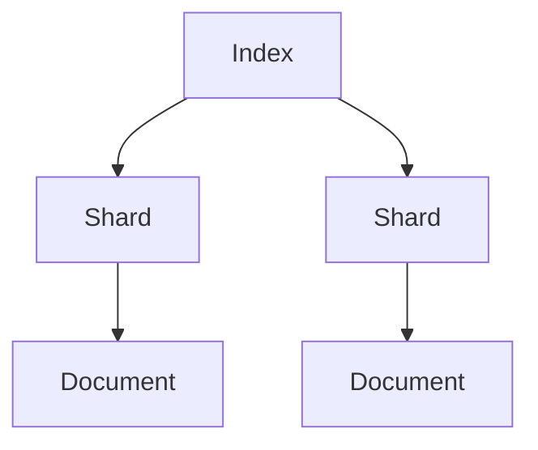
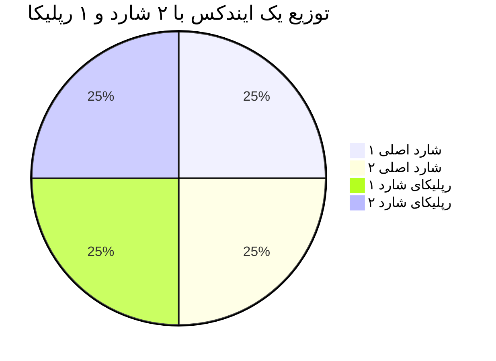

# آموزش دنیای الستیک - قسمت چهارم Logstash

لاگستش Logstash یه ابزاره توی استک Elasticه که کارش جمع‌آوری، پردازش و ارسال داده‌هاست.
>  خود لاگ های خام برای الستیک هم مشکل ساز هستند چون خیلی وقتا خیلی لاگ ها به دردمان نمیخورد ولی تولید میشود ... خیلی وقتا لاگ ها محتوا های شلوغی دارند و بعدا ذخیره و بازیابی آنها سخت خواهد بود.

قبل از Logstash، برای جمع‌آوری لاگ‌ها باید خودتون اسکریپت می‌نوشتید.
این اسکریپت‌ها سخت نگه‌داری می‌شدن و هر بار که چیزی عوض می‌شد، باید کلی تغییرشون می‌دادید. Logstash این کار رو استاندارد و ساده کرد.


**لاگستش مثل یه پستچی باهوشه که:**

**جمع‌آوری**: لاگ‌ها رو از فایل‌ها، سرورها یا هر جای دیگه می‌گیره.
    
**پردازش**: داده‌ها رو مرتب می‌کنه (مثلاً تاریخ و ساعت رو جدا می‌کنه).
    
**ارسال**: به Elasticsearch می‌فرسته تا ذخیره بشن.
    
---


> 


> 


> ابزار Logstash اومد که داده‌ها رو از هر منبعی بگیره، تمیزشون کنه و آماده‌ی استفاده توی Elasticsearch کنه.
> مثلاً اگه لاگ‌هاتون توی یه فایل متنیه، Logstash می‌تونه خط به خط بخوندشون و به فرمت JSON بفرسته.
---

## 12. Kibana چه جایگاهی داره؟

Kibana ابزار بصری‌سازی استک Elasticه. فکر کنید Elasticsearch یه انبار بزرگ داده‌هاست؛ Kibana پنجره‌ایه که بهتون اجازه می‌ده داخل انبار رو ببینید و بفهمید چی داره اتفاق می‌افته. کارش اینه:

- **نمایش داده‌ها**: لاگ‌ها رو به شکل نمودار، جدول یا نقشه نشون می‌ده.
- **تحلیل ساده**: با چند کلیک می‌تونید داده‌ها رو بررسی کنید.
- **دسترسی برای همه**: حتی کسایی که فنی نیستن هم می‌تونن ازش استفاده کنن.

مثلاً می‌تونید یه داشبورد بسازید که نشون بده هر ساعت چند تا خطا داشتید—همه‌چیز با رنگ و شکل قشنگ!

---

## 13. مفاهیم اولیه استک Elastic (الفبای Elastic)

حالا که کلیات رو فهمیدیم، بیایم الفبای Elasticsearch رو یاد بگیریم. این مفاهیم پایه‌ی کارن و توی اپیزودهای بعدی عمیق‌تر می‌شن.

### Document (داکیومنت)
- **چیه؟**: یه واحد داده توی Elastic که به صورت JSON ذخیره می‌شه. مثل یه برگه کاغذه که اطلاعات روش نوشته شده.
- **مثال ساده**: یه لاگ می‌تونه یه داکیومنت باشه:
  ```json
  {
    "time": "2025-07-20 10:00",
    "message": "صفحه باز شد",
    "user": "علی"
  }
  ```

### Index (ایندکس)
- **چیه؟**: یه مجموعه از داکیومنت‌ها که شبیه همن. مثل یه پوشه توی کمد که برگه‌های مشابه رو توش نگه می‌دارید.
- **مثال**: یه ایندکس به اسم `web-logs` می‌تونه همه‌ی لاگ‌های سایتتون رو نگه داره.

### Inverted Index (ایندکس معکوس)
- **چیه؟**: یه فهرست هوشمند که نشون می‌ده هر کلمه توی کدوم داکیومنت‌ها هست. این قلب جستجوی سریع Elasticه.
- **مثال**: اگه دو داکیومنت داشته باشیم:
  - داکیومنت ۱: "سریع و خوب"
  - داکیومنت ۲: "سریع و قوی"
  فهرست معکوس می‌گه: "سریع" توی داکیومنت ۱ و ۲ هست، "خوب" فقط توی ۱، و "قوی" فقط توی ۲.

### Shard (شارد)
- **چیه؟**: یه تکه از ایندکس که جداگانه ذخیره می‌شه. مثل اینه که یه پوشه‌ی بزرگ رو به چند بخش کوچیک تقسیم کنید.
- **چرا مهمه؟**: شارد‌ها باعث می‌شن داده‌ها توی چند سرور پخش بشن و کار سریع‌تر انجام بشه.
- **مثال**: اگه ایندکس `web-logs` شما ۱۰۰ گیگ داده داره، می‌تونید به ۵ شارد ۲۰ گیگی تقسیمش کنید.

### Replica (رپلیکا)
- **چیه؟**: یه کپی از شارد که جای دیگه نگه‌داری می‌شه. مثل اینه که از مدارک مهم‌تون یه نسخه‌ی پشتیبان داشته باشید.
- **چرا مهمه؟**: اگه یه سرور خراب بشه، رپلیکا وارد عمل می‌شه و کار ادامه پیدا می‌کنه.
- **مثال**: شارد ۱ توی سرور A هست، رپلیکاش توی سرور B.

### Node (نود)
- **چیه؟**: یه سرور یا ماشین توی Elastic که کار ذخیره و پردازش داده‌ها رو انجام می‌ده. مثل یه کارگر توی یه تیمه.
- **انواعش**: 
  - **Data Node**: داده‌ها رو نگه می‌داره.
  - **Master Node**: تیم رو مدیریت می‌کنه.
- **مثال**: اگه ۳ نود داشته باشید، داده‌ها بینشون پخش می‌شه.

### Cluster (کلاستر)
- **چیه؟**: یه گروه از نودها که با هم کار می‌کنن. مثل یه تیم کاری که همه باهم یه پروژه رو جلو می‌برن.
- **مثال**: یه کلاستر با ۵ نود می‌تونه ۱ ترابایت داده رو مدیریت کنه.

### Data Type (نوع داده)
- **چیه؟**: مشخص می‌کنه هر فیلد توی داکیومنت چه نوعیه. مثل اینه که بگید این ستون توی دفترچه‌تون عدد باشه یا متن.
- **انواع رایج**:
  - **text**: برای متن‌های بلند که می‌خواهید جستجو کنید (مثل "پیام خطا").
  - **keyword**: برای متن‌های کوتاه که دقیق باید پیدا بشن (مثل "کد کاربر").
  - **date**: برای تاریخ و ساعت.
  - **number**: برای اعداد.
- **مثال**: توی داکیومنت بالا، `time` یه date‌ـه و `message` یه text.

### Mapping (نقشه‌بندی)
- **چیه؟**: یه دستورالعمل که می‌گه هر فیلد توی ایندکس چه نوع داده‌ایه و چطور ذخیره بشه. مثل یه نقشه‌ی راه برای Elastic.
- **مثال**: می‌تونید بگید فیلد `message` به صورت text باشه و کلماتش جدا جدا ذخیره بشن برای جستجوی بهتر.

---

## جمع‌بندی

توی این اپیزود، با مفاهیم اولیه‌ی استک Elastic آشنا شدیم. فهمیدیم از کجا اومده، چرا به وجود اومده، چه ارتباطی با DevOps و لاگ‌ها داره و چرا دیتابیس‌های قدیمی نمی‌تونن جاش رو بگیرن. ابزارهای Logstash و Kibana رو شناختیم و الفبای Elasticsearch—مثل داکیومنت، ایندکس، شارد و نود—رو یاد گرفتیم. همه‌چیز با مثال‌های ساده و تحلیلی توضیح داده شد تا پایه‌تون محکم بشه.

توی اپیزودهای بعدی، عمیق‌تر می‌شیم و کاربردها و تنظیمات عملی رو بررسی می‌کنیم. اگه سوالی دارید، بپرسید—خوشحال می‌شم کمک کنم!


---

## 2. چرا به وجود آمده؟

قبل از Elastic، اگه می‌خواستید توی داده‌های بزرگ جستجو کنید یا تحلیلشون کنید، معمولاً مجبور بودید از دیتابیس‌های رابطه‌ای مثل MySQL یا PostgreSQL استفاده کنید. ولی این دیتابیس‌ها برای این کار ساخته نشده بودن. فرض کنید یه کتابخونه‌ی بزرگ دارید و می‌خواهید همه‌ی کتاب‌هایی که کلمه‌ی "جنگ" توشون هست رو پیدا کنید. دیتابیس‌های قدیمی مثل این بودن که مجبور بشید تک‌تک صفحات همه‌ی کتاب‌ها رو بخونید—خیلی کند و خسته‌کننده!

Elasticsearch اومد که این مشکل رو حل کنه. با یه روش هوشمندانه (که بعداً بهش می‌رسیم، به اسم inverted index) و توانایی کار با داده‌ها به صورت توزیع‌شده، جستجو و تحلیل رو سریع و انعطاف‌پذیر کرد.

---

## 3. چه ارتباطی با DevOps داره؟

DevOps یه روش کاریه که توی اون تیم‌های توسعه‌ی نرم‌افزار (Dev) و عملیات (Ops) با هم همکاری می‌کنن تا نرم‌افزار سریع‌تر و بهتر ساخته و تحویل داده بشه. توی این روش، مانیتورینگ (نظارت) و عیب‌یابی سریع خیلی مهمه. استک Elastic اینجا وارد می‌شه:

- **مانیتورینگ real-time**: مثلاً می‌تونید ببینید سرورها یا برنامه‌هاتون الان چه وضعی دارن.
- **تحلیل لاگ‌ها**: لاگ‌ها مثل دفترچه‌ی خاطرات سیستم هستن و Elastic بهتون کمک می‌کنه بفهمید کجا مشکلی پیش اومده.
- **رفع سریع مشکل**: وقتی چیزی خراب می‌شه، Elastic به تیم‌های DevOps کمک می‌کنه سریع بفهمن چی شده و چطور درستش کنن.

به زبان ساده، Elastic مثل یه دستیار باهوش برای تیم‌های DevOps عمل می‌کنه.

---

## 4. چه دردی رو حل کرد؟ (با مثال)

فرض کنید یه وب‌سایت بزرگ مثل دیجی‌کالا دارید. هر روز میلیون‌ها نفر میان تو سایتتون و کلی لاگ تولید می‌شه—مثلاً کی چه صفحه‌ای رو باز کرده، کی خطایی رخ داده، یا کی خرید کرده. حالا اگه بخواید بفهمید "توی ۵ دقیقه‌ی گذشته چند تا خطای ۵۰۰ (خطای سرور) داشتیم"، توی دیتابیس‌های قدیمی باید کل داده‌ها رو اسکن می‌کردید که ممکن بود ساعت‌ها طول بکشه.

Elasticsearch این کار رو توی چند ثانیه انجام می‌ده. چون داده‌ها رو طوری ذخیره و سازمان‌دهی می‌کنه که پیدا کردن جواب سوال‌های پیچیده سریع باشه. این یعنی درد "کندی و سختی جستجو توی داده‌های بزرگ" رو حل کرده.

---

## 5. جایگاهش توی DevOps چیه؟

توی DevOps، استک Elastic یه ستون مهم برای **لاگینگ** و **مانیتورینگ**ه. جایگاهش اینه:

- **جمع‌آوری داده‌ها**: با Logstash و Beats لاگ‌ها رو از جاهای مختلف جمع می‌کنه.
- **ذخیره و جستجو**: با Elasticsearch لاگ‌ها رو نگه می‌داره و بهتون امکان جستجوی سریع می‌ده.
- **نمایش و تحلیل**: با Kibana داده‌ها رو به شکل نمودار و داشبورد نشون می‌ده تا راحت‌تر بفهمید چی به چیه.

به عبارتی، Elastic به تیم‌های DevOps کمک می‌کنه سیستم‌هاشون رو شفاف‌تر ببینن و سریع‌تر واکنش نشون بدن.

---

## 6. چه کاربردهایی داره؟

استک Elastic فقط برای DevOps نیست، کلی کاربرد دیگه هم داره:

- **جستجوی متنی**: مثلاً توی یه فروشگاه آنلاین دنبال "لپ‌تاپ" بگردید.
- **تحلیل لاگ**: بررسی خطاهای سرور یا رفتار کاربرها.
- **مانیتورینگ**: نظارت روی عملکرد برنامه‌ها و سرورها.
- **امنیت**: پیدا کردن تهدیدات امنیتی با تحلیل داده‌ها (مثل SIEM).
- **تحلیل کسب‌وکار**: مثلاً بفهمید مشتری‌ها بیشتر چی می‌خرن.

---

## 7. چه ارتباطی با لاگ‌ها داره؟

لاگ‌ها مثل ردپای سیستم‌ها و برنامه‌ها هستن. مثلاً یه لاگ می‌گه: "کاربر X ساعت ۸ صبح یه صفحه رو باز کرد و خطای ۴۰۴ گرفت." استک Elastic برای کار با این لاگ‌ها طراحی شده:

- **Elasticsearch**: لاگ‌ها رو ذخیره و آماده‌ی جستجو می‌کنه.
- **Logstash و Beats**: لاگ‌ها رو از سرورها یا فایل‌ها جمع می‌کنه و مرتبشون می‌کنه.
- **Kibana**: لاگ‌ها رو به شکل نمودار و جدول نشون می‌ده.

به زبان ساده، Elastic بهترین دوست لاگ‌هاست!

---

## 8. چرا تحلیل و ذخیره‌سازی لاگ‌ها مهمه؟

لاگ‌ها گنجینه‌ی اطلاعاتن. چرا مهمن؟

- **عیب‌یابی**: اگه یه برنامه خراب بشه، لاگ‌ها بهتون می‌گن کجا و چرا.
- **بهبود عملکرد**: می‌فهمید سیستم کجاها کند شده و چطور بهترش کنید.
- **امنیت**: لاگ‌ها نشون می‌دن کی سعی کرده هک کنه یا یه چیز مشکوک شده.
- **تصمیم‌گیری**: با تحلیل لاگ‌ها می‌فهمید کاربرها چیکار می‌کنن و چطور خدماتتون رو بهتر کنید.

مثلاً اگه یه فروشگاه آنلاین دارید، لاگ‌ها می‌گن چند نفر سبد خریدشون رو ول کردن و نخریدن—این یعنی یه سرنخ برای بهتر کردن سایتتون.

---

## 9. چرا بقیه دیتابیس‌ها رو نمی‌شه جای Elastic استفاده کرد؟

دیتابیس‌های رابطه‌ای (مثل MySQL) برای کارهایی مثل ذخیره‌ی اطلاعات مشتری یا تراکنش‌های بانکی طراحی شدن، نه برای جستجو و تحلیل داده‌های بزرگ و شلخته (مثل لاگ‌ها). فرقشون اینه:

- **ساختار سفت و سخت**: دیتابیس‌های رابطه‌ای به جدول‌های منظم نیاز دارن، ولی لاگ‌ها معمولاً نامنظمن.
- **جستجوی کند**: برای جستجوی متنی توی داده‌های بزرگ خیلی کندن.
- **مقیاس‌پذیری سخت**: وقتی داده‌ها زیاد بشن، مدیریتشون توی دیتابیس‌های قدیمی سخت می‌شه.

Elastic برای داده‌های بزرگ، جستجوی سریع و انعطاف‌پذیری ساخته شده.

---

## 10. ضعف‌های دیتابیس‌های قبلی (با مثال ساده)

فرض کنید یه دفترچه یادداشت دارید که توش هر خط یه لاگ از وب‌سایتتونه. حالا می‌خواهید همه‌ی خط‌هایی که کلمه‌ی "error" توشون هست رو پیدا کنید:

- **دیتابیس رابطه‌ای**: باید تک‌تک خط‌ها رو بخونید (مثل اسکن کردن کل دفترچه با دست). این کار برای ۱۰ خط خوبه، ولی برای ۱ میلیون خط افتضاحه!
- **Elasticsearch**: یه فهرست آماده داره که می‌گه "error" توی کدوم خط‌هاست (مثل یه فهرست آخر کتاب). برای همین توی چند ثانیه جواب می‌ده.

ضعف دیتابیس‌های قدیمی توی سرعت و انعطاف‌پذیری برای داده‌های بزرگه.

---

## 11. Logstash چیه و چرا ازش استفاده می‌کنیم؟

Logstash یه ابزار توی استک Elasticه که کارش جمع‌آوری، پردازش و ارسال داده‌هاست. مثل یه پستچی باهوشه که:

- **جمع‌آوری**: لاگ‌ها رو از فایل‌ها، سرورها یا هر جای دیگه می‌گیره.
- **پردازش**: داده‌ها رو مرتب می‌کنه (مثلاً تاریخ و ساعت رو جدا می‌کنه).
- **ارسال**: به Elasticsearch می‌فرسته تا ذخیره بشن.

### چرا بهش نیاز پیدا شد؟
قبل از Logstash، برای جمع‌آوری لاگ‌ها باید خودتون اسکریپت می‌نوشتید. این اسکریپت‌ها سخت نگه‌داری می‌شدن و هر بار که چیزی عوض می‌شد، باید کلی تغییرشون می‌دادید. Logstash این کار رو استاندارد و ساده کرد.

### رسالتش چیه؟
Logstash اومد که داده‌ها رو از هر منبعی بگیره، تمیزشون کنه و آماده‌ی استفاده توی Elasticsearch کنه. مثلاً اگه لاگ‌هاتون توی یه فایل متنیه، Logstash می‌تونه خط به خط بخوندشون و به فرمت JSON بفرسته.

---

## 12. Kibana چه جایگاهی داره؟

Kibana ابزار بصری‌سازی استک Elasticه. فکر کنید Elasticsearch یه انبار بزرگ داده‌هاست؛ Kibana پنجره‌ایه که بهتون اجازه می‌ده داخل انبار رو ببینید و بفهمید چی داره اتفاق می‌افته. کارش اینه:

- **نمایش داده‌ها**: لاگ‌ها رو به شکل نمودار، جدول یا نقشه نشون می‌ده.
- **تحلیل ساده**: با چند کلیک می‌تونید داده‌ها رو بررسی کنید.
- **دسترسی برای همه**: حتی کسایی که فنی نیستن هم می‌تونن ازش استفاده کنن.

مثلاً می‌تونید یه داشبورد بسازید که نشون بده هر ساعت چند تا خطا داشتید—همه‌چیز با رنگ و شکل قشنگ!

---

## 13. Beats چه جایگاهی داره؟

Beats یه مجموعه ابزار سبک‌وزنه که برای جمع‌آوری داده‌های خاص طراحی شده. مثل یه تیم متخصص که هر کدوم برای یه کار خاصن:

- **Filebeat**: برای جمع‌آوری لاگ‌های فایل.
- **Metricbeat**: برای جمع‌آوری معیارهای سیستم (مثل CPU و RAM).
- **Packetbeat**: برای مانیتورینگ شبکه.

### چرا بهشون نیاز داریم؟
Logstash می‌تونه داده‌ها رو جمع کنه، ولی Beats سبک‌تر و تخصصی‌ترن. مثلاً Filebeat فقط روی جمع‌آوری لاگ‌های فایل تمرکز داره و منابع کمتری مصرف می‌کنه.

---

## 14. Apache Lucene: چی بود و چه کاری می‌کرد؟

**Apache Lucene** یه کتابخونه‌ی متن‌باز برای جستجوی متنیه که توسط Doug Cutting در سال ۱۹۹۹ ساخته شد. Lucene مثل یه موتور جستجوی قدرتمنده که می‌تونه توی متن‌ها بگرده و نتایج رو سریع پیدا کنه.

### چه کاری می‌کرد؟
Lucene از یه تکنیک به اسم **inverted index** (فهرست معکوس) استفاده می‌کنه. فرض کنید یه کتاب دارید و می‌خواهید بفهمید کلمه‌ی "جنگ" توی کدوم صفحاته. به جای اینکه کل کتاب رو بخونید، Lucene یه فهرست درست می‌کنه که می‌گه "جنگ" توی صفحات ۵، ۱۰ و ۱۵ هست. اینطوری جستجو خیلی سریع می‌شه.

### ارتباطش با Elasticsearch چیه؟
Elasticsearch بر پایه‌ی Lucene ساخته شده. در واقع، Elasticsearch یه لایه‌ی بالاتر روی Lucene اضافه کرده که امکاناتی مثل توزیع‌شدگی، مقیاس‌پذیری و APIهای ساده رو فراهم می‌کنه. به عبارت دیگه، Lucene موتور جستجوی زیرساختیه و Elasticsearch یه سیستم کامل برای کار با داده‌های بزرگ.

### مثال ساده:
فرض کنید Lucene یه موتور ماشین باشه—قوی و کارآمد، ولی برای استفاده‌ی روزمره به بدنه و فرمان و صندلی نیاز داره. Elasticsearch همون ماشینه که موتور Lucene رو داره و آماده‌ی رانندگیه.

---

## 15. مفاهیم اولیه استک Elastic (الفبای Elastic)

حالا که کلیات رو فهمیدیم، بیایم الفبای Elasticsearch رو یاد بگیریم. این مفاهیم پایه‌ی کارن و توی اپیزودهای بعدی عمیق‌تر می‌شن.

### Document (داکیومنت)
- **چیه؟**: یه واحد داده توی Elastic که به صورت JSON ذخیره می‌شه. مثل یه برگه کاغذه که اطلاعات روش نوشته شده.
- **مثال ساده**: یه لاگ می‌تونه یه داکیومنت باشه:
  ```json
  {
    "time": "2025-07-20 10:00",
    "message": "صفحه باز شد",
    "user": "علی"
  }
  ```

### Index (ایندکس)
- **چیه؟**: یه مجموعه از داکیومنت‌ها که شبیه همن. مثل یه پوشه توی کمد که برگه‌های مشابه رو توش نگه می‌دارید.
- **مثال**: یه ایندکس به اسم `web-logs` می‌تونه همه‌ی لاگ‌های سایتتون رو نگه داره.

### Inverted Index (ایندکس معکوس)
- **چیه؟**: یه فهرست هوشمند که نشون می‌ده هر کلمه توی کدوم داکیومنت‌ها هست. این قلب جستجوی سریع Elasticه.
- **مثال**: اگه دو داکیومنت داشته باشیم:
  - داکیومنت ۱: "سریع و خوب"
  - داکیومنت ۲: "سریع و قوی"
  فهرست معکوس می‌گه: "سریع" توی داکیومنت ۱ و ۲ هست، "خوب" فقط توی ۱، و "قوی" فقط توی ۲.

### Shard (شارد)
- **چیه؟**: یه تکه از ایندکس که جداگانه ذخیره می‌شه. مثل اینه که یه پوشه‌ی بزرگ رو به چند بخش کوچیک تقسیم کنید.
- **چرا مهمه؟**: شارد‌ها باعث می‌شن داده‌ها توی چند سرور پخش بشن و کار سریع‌تر انجام بشه.
- **مثال**: اگه ایندکس `web-logs` شما ۱۰۰ گیگ داده داره، می‌تونید به ۵ شاردascan ۵ گیگ داده رو به ۵ شارد ۲۰ گیگی تقسیمش کنید.

### Replica (رپلیکا)
- **چیه؟**: یه کپی از شارد که جای دیگه نگه‌داری می‌شه. مثل اینه که از مدارک مهم‌تون یه نسخه‌ی پشتیبان داشته باشید.
- **چرا مهمه؟**: اگه یه سرور خراب بشه، رپلیکا وارد عمل می‌شه و کار ادامه پیدا می‌کنه.
- **مثال**: شارد ۱ توی سرور A هست، رپلیکاش توی سرور B.

### Node (نود)
- **چیه؟**: یه سرور یا ماشین توی Elastic که کار ذخیره و پردازش داده‌ها رو انجام می‌ده. مثل یه کارگر توی یه تیمه.
- **انواعش**: 
  - **Data Node**: داده‌ها رو نگه می‌داره.
  - **Master Node**: تیم رو مدیریت می‌کنه.
- **مثال**: اگه ۳ نود داشته باشید، داده‌ها بینشون پخش می‌شه.

### Cluster (کلاستر)
- **چیه؟**: یه گروه از نودها که با هم کار می‌کنن. مثل یه تیم کاری که همه باهم یه پروژه رو جلو می‌برن.
- **مثال**: یه کلاستر با ۵ نود می‌تونه ۱ ترابایت داده رو مدیریت کنه.

### Data Type (نوع داده)
- **چیه؟**: مشخص می‌کنه هر فیلد توی داکیومنت چه نوعیه. مثل اینه که بگید این ستون توی دفترچه‌تون عدد باشه یا متن.
- **انواع رایج**:
  - **text**: برای متن‌های بلند که می‌خواهید جستجو کنید (مثل "پیام خطا").
  - **keyword**: برای متن‌های کوتاه که دقیق باید پیدا بشن (مثل "کد کاربر").
  - **date**: برای تاریخ و ساعت.
  - **number**: برای اعداد.
- **مثال**: توی داکیومنت بالا، `time` یه date‌ـه و `message` یه text.

### Mapping (نقشه‌بندی)
- **چیه؟**: یه دستورالعمل که می‌گه هر فیلد توی ایندکس چه نوع داده‌ایه و چطور ذخیره بشه. مثل یه نقشه‌ی راه برای Elastic.
- **مثال**: می‌تونید بگید فیلد `message` به صورت text باشه و کلماتش جدا جدا ذخیره بشن برای جستجوی بهتر.

---

## جمع‌بندی

توی این اپیزود، با مفاهیم اولیه‌ی استک Elastic آشنا شدیم. فهمیدیم از کجا اومده، چرا به وجود اومده، چه ارتباطی با DevOps و لاگ‌ها داره و چرا دیتابیس‌های قدیمی نمی‌تونن جاش رو بگیرن. ابزارهای Logstash، Kibana و Beats رو شناختیم و الفبای Elasticsearch—مثل داکیومنت، ایندکس، شارد و نود—رو یاد گرفتیم. همه‌چیز با مثال‌های ساده و تحلیلی توضیح داده شد تا پایه‌تون محکم بشه.

توی اپیزودهای بعدی، عمیق‌تر می‌شیم و کاربردها و تنظیمات عملی رو بررسی می‌کنیم. اگه سوالی دارید، بپرسید—خوشحال می‌شم کمک کنم!


# اپیزود اول: ورود عمیق و مفهومی به دنیای Elastic Stack


---

## ارتباط Elastic با DevOps

الستیک‌استک یکی از ابزارهای کلیدی در **DevOps** است. چرا؟ چون DevOps یعنی:

- مانیتورینگ دائمی سیستم‌ها
- تحلیل رخدادها
- یافتن ریشه‌ی مشکلات
- پاسخ سریع به تغییرات

برای این اهداف، لاگ‌ها مهم‌ترین منبع هستند. Elastic Stack لاگ‌ها را تبدیل به **داده‌ای قابل تحلیل و قابل مشاهده** می‌کند. بدون آن، تیم‌های DevOps در تاریکی عمل می‌کنند.

---

## اجزای اصلی Elastic Stack چیست؟

### ۱. Elasticsearch

هسته‌ی اصلی. یک موتور جستجوی **مبتنی بر Lucene** که داده‌ها را به صورت **داکیومنت** ذخیره می‌کند و از **ایندکس معکوس** برای جستجوی سریع استفاده می‌کند.

### ۲. Logstash

یک پردازشگر قدرتمند داده. داده‌ها را از منابع مختلف جمع می‌کند، فیلتر می‌کند و به Elasticsearch می‌فرستد.

### ۳. Kibana

ابزار ویژوال‌سازی. با آن می‌توان داشبورد ساخت، لاگ‌ها را جستجو کرد، آمار تحلیل کرد و حتی با آن هشدار تنظیم کرد.

### ۴. Beats (در اپیزود بعدی بررسی می‌شود)

ابزارهای سبک برای ارسال داده از منابع مختلف مثل سیستم‌عامل، اپلیکیشن و غیره.

---

## مفاهیم کلیدی در Elastic Search (با زبان ساده و مثال)

### 📄 داکیومنت (Document)

یعنی یک رکورد از اطلاعات. مثال:

```json
{
  "user": "Ali",
  "action": "login",
  "timestamp": "2025-07-20T10:00:00"
}
```

### 📁 ایندکس (Index)

مثل یک جدول در دیتابیس رابطه‌ای. مجموعه‌ای از داکیومنت‌ها با ساختار مشابه. مثلاً: index به نام `logs-2025` مخصوص لاگ‌های امسال.

### 🔄 ایندکسینگ معکوس (Inverted Index)

برخلاف دیتابیس‌های سنتی که برای هر رکورد فیلد ذخیره می‌کنند، در ایندکس معکوس هر کلمه کلیدی را نگه می‌داریم و لیست داکیومنت‌هایی که آن را دارند.

مثال:

```
کلمه «login» در داکیومنت‌های 1، 3، 7 وجود دارد.
```

این باعث می‌شود جستجو بسیار سریع انجام شود.

### 🧩 شارد (Shard) و رپلیکا (Replica)

- **شارد**: برش‌های فیزیکی از یک ایندکس برای تقسیم بار و مقیاس‌پذیری.
- **رپلیکا**: نسخه‌های کپی شاردها برای تحمل خطا.

مثال:

```
ایندکس «logs» ← شامل 5 شارد اصلی + 1 رپلیکا برای هر شارد.
```

### ⚙️ نود (Node) و کلاستر (Cluster)

- **نود**: یک سرور که Elasticsearch روی آن اجرا می‌شود.
- **کلاستر**: مجموعه‌ای از نودها که با هم کار می‌کنند.

---

## Logstash چیست و چرا باید باشد؟

Logstash پلی است بین منابع داده (فایل‌های لاگ، پایگاه‌داده، API و ...) و Elasticsearch.

### ویژگی‌ها:

- دریافت داده از منابع مختلف
- فیلتر و پردازش (مثلاً استخراج فیلد از لاگ)
- ارسال به مقصد (مثلاً Elasticsearch)

### چرا ساخته شد؟

چون داده خام بی‌ارزش است. ما نیاز داریم:

- داده را پاکسازی کنیم
- تگ بدهیم
- ساختار بدهیم

بدون Logstash، داده‌ها پراکنده، کثیف و پردازش‌نشده باقی می‌مانند.

---

## Kibana چیست و چه می‌کند؟

Kibana محیطی است برای دیدن آن‌چه در Elasticsearch ذخیره شده.

- جستجو و فیلتر لاگ‌ها
- ساخت داشبورد
- نمودار و گراف
- تعریف هشدار

### مثال:

می‌خواهید ببینید در ۲۴ ساعت گذشته چند بار ارور ۵۰۰ رخ داده؟ Kibana فقط با چند کلیک این را به شما نشان می‌دهد.

---

## چرا دیتابیس‌های سنتی برای لاگ مناسب نیستند؟

### مشکل دیتابیس‌های کلاسیک:

- اسکیما ثابت
- ضعف در جستجوی متنی
- کند بودن در حجم بالا
- عدم مقیاس‌پذیری افقی

### مثال مقایسه‌ای:

- در MySQL برای جستجوی لاگ‌هایی که شامل کلمه «error» هستند باید کل جدول را اسکن کنید.
- در Elasticsearch با ایندکس معکوس فقط کلمه «error» را بررسی می‌کنید.

---

## چرا ذخیره‌سازی و تحلیل لاگ مهم است؟

- تشخیص سریع خطاها (زمان واقعی)
- بررسی روندها و پیش‌بینی آینده
- تحلیل رفتار کاربران
- پاسخ سریع به رخدادهای امنیتی

بدون تحلیل لاگ‌ها، فقط اتفاقات را "می‌بینید"، ولی نمی‌توانید آن‌ها را "درک" یا "پیش‌بینی" کنید.

---

## جمع‌بندی اپیزود اول:

در این اپیزود، با مفاهیم پایه‌ای Elastic Stack آشنا شدیم:

- از تاریخچه و دلیل وجودش گفتیم
- اجزای اصلی را شناختیم: Elasticsearch، Logstash، Kibana
- مفاهیم اولیه را بررسی کردیم: داکیومنت، ایندکس، شارد، رپلیکا، نود
- ارتباط آن با DevOps را درک کردیم
- اهمیت تحلیل لاگ‌ها و برتری الستیک نسبت به دیتابیس‌های کلاسیک را دریافتیم

در اپیزودهای بعدی، وارد دنیای عملی نصب، کانفیگ و استفاده واقعی از Elastic Stack خواهیم شد.

---

> در صورتی که سوال یا تجربه‌ای از دنیای لاگ، مانیتورینگ یا الستیک دارید، در کامنت‌ها با ما به اشتراک بگذارید!


# اپیزود اول: مفاهیم پایه و ورود به دنیای الستیک استک (ELK Stack)


## 2. ارتباط با DevOps و جایگاه در آن

### ⚙️ چرا در دنیای DevOps مهمه؟

در فرآیندهای DevOps، یکی از ارکان مهم مانیتورینگ و مشاهده‌پذیری (Observability) سیستمه. DevOps بدون بررسی لاگ‌ها، خطاها، متریک‌ها و رفتار سیستم، مثل رانندگی در مه است.

### 📦 چه دردی رو حل کرد؟

* جمع‌آوری لاگ از چندین سرور
* ایندکس‌گذاری سریع برای جستجوهای بلادرنگ
* مصورسازی داده‌ها برای تحلیل سریع

> **مثال ساده:** فرض کن ۵ تا سرور داری و می‌خوای بدونی خطای 500 کِی و کجا رخ داده؟ اگه بخوای دستی فایل‌های لاگ رو بگردی، ساعت‌ها طول می‌کشه. اما با Elastic Stack، توی چند ثانیه می‌تونی سرچ بزنی: `status:500 AND path:/login`.

---

## 3. چرا لاگ مهمه؟

### 🛠 چرا ذخیره‌سازی و تحلیل لاگ اهمیت داره؟

* تحلیل رفتار کاربران
* کشف باگ و خطاها
* بررسی امنیت و نفوذ
* پاسخ سریع به رخدادها (incident response)

### 💽 چرا دیتابیس‌های قبلی کافی نبودن؟

* MySQL یا MongoDB برای جستجو در داده‌های متنی و حجیم عملکرد کندی دارن
* ساختار آن‌ها مناسب log analytics نیست

> **مثال:** وقتی دنبال همه‌ی ارورهای شامل "timeout" توی لاگ‌ها هستی، Elasticsearch در چند میلی‌ثانیه نشونت می‌ده. اما MySQL باید کل جدول رو اسکن کنه.

---

## 4. اجزای Elastic Stack و نقش هرکدام

### 📊 Elasticsearch

هسته اصلی سیستم که کار ایندکس، جستجو، ذخیره‌سازی و آنالیز داده رو انجام می‌ده.

### 🧃 Logstash

سیستم پردازش داده؛ داده‌ها رو از منابع مختلف می‌گیره، پاک‌سازی/تغییر می‌ده و می‌فرسته به Elasticsearch.

### 📈 Kibana

رابط کاربری زیبا برای نمایش داده‌ها و داشبوردهای تحلیلی.

### 🐞 Beats

ابزارهای سبک‌وزن برای ارسال لاگ از کلاینت‌ها (مثل Filebeat، Metricbeat).

---

## 5. Apache Lucene و رابطه‌اش با Elasticsearch

### 🔎 Lucene چیه؟

کتابخونه‌ای جاوا بیس برای جستجوی متن و ایندکس‌گذاری معکوس (inverted index). خیلی قدرتمنده ولی استفاده ازش برای اپلیکیشن‌ها سخته.

### 🤝 ارتباط با Elasticsearch

Elasticsearch در اصل یک لایه‌ی آسان‌کننده بر پایه‌ی Lucene هست. همه‌ی ایندکس‌ها و کوئری‌ها در نهایت به Lucene می‌رسن.

> **مثال ساده:** فرض کن Lucene موتور خام یک ماشین مسابقه است. Elasticsearch شاسی، بدنه و رابط فرمانش رو می‌سازه.

---

## 6. مفاهیم پایه‌ای Elastic

### 📄 Document

یک رکورد داده، معمولاً به‌صورت JSON. مثلاً:

```json
{
  "user": "Ali",
  "status": 500,
  "url": "/login",
  "timestamp": "2025-07-20T12:00:00"
}
```

### 📦 Index

مجموعه‌ای از داکیومنت‌ها با ساختار مشابه.

### 🔄 Inverted Index

ساختار جستجو برای داده‌های متنی؛ به جای اینکه بپرسیم "این سند چه کلمات داره؟"، می‌پرسیم "این کلمه در چه سندهایی اومده؟"

### ⚙️ Node

یک ماشین که عضو کلاستر الستیکه و وظایف خاصی داره.

### 🧱 Shard

برای توزیع ایندکس‌ها، داده‌ها به بخش‌های کوچک‌تر به نام Shard تقسیم می‌شن.

### 🛡 Replica

کپی‌هایی از shardها برای افزونگی و بالا بردن دسترسی (High Availability).

---

## 7. Logstash دقیق‌تر

### 🧰 چی هست؟

یک پایپ‌لاین برای انتقال و تغییر شکل داده.

### 📥 چرا نیازش حس شد؟

چون داده‌های ورودی همیشه تمیز نیستن. نیاز داریم:

* فرمت‌های مختلف رو یکپارچه کنیم
* فیلدها رو اصلاح یا استخراج کنیم (مثل regex روی لاگ)
* مسیر انتقال به Elasticsearch رو مدیریت کنیم

---

## 8. نقش Kibana

* داشبوردسازی
* نمایش زنده داده‌ها
* ابزار کشف داده (Discover)
* آلارم و بصری‌سازی

---

## 9. نقش Beats

* ارسال داده از کلاینت‌ها (مثلاً Filebeat برای ارسال لاگ‌ها از فایل‌ها)
* سبک و سریع؛ بدون سربار زیاد

---

## ✅ جمع‌بندی اپیزود اول

در این اپیزود فهمیدیم:

* چرا Elastic Stack بوجود آمد و چطور نیازهای واقعی DevOps رو پاسخ داد
* چرا تحلیل لاگ حیاتی است
* ساختار و اجزای اصلی الستیک چیست
* مفاهیم بنیادی مثل داکیومنت، ایندکس، نود، شارد و ... را شناختیم
* Lucene هسته‌ی جستجوی الستیکه

> در اپیزود بعدی وارد نصب، راه‌اندازی و اولین کوئری‌ها می‌شویم.

---

> نویسنده: ChatGPT | بازبینی و ساختاردهی شده برای زبان فارسی | تاریخ: ۲۰۲۵/۰۴


# اپیزود ۱: مفاهیم پایه و فلسفه وجودی Elastic Stack

```markdown
# 🚀 اپیزود ۱: مقدمات Elastic Stack - از صفر تا مفاهیم پایه

## 🌍 Elastic از کجا آمد و چرا به وجود آمد؟


📌 **مثال ملموس**: تصور کنید می‌خواهید در ۱۰۰ میلیون سند PDF کلمه "خطای سرور" را پیدا کنید. جستجوی معمولی مثل grep ممکن است ساعت‌ها طول بکشد، اما Elasticsearch این کار را در **چند میلی‌ثانیه** انجام می‌دهد!

## 🔍 دردهایی که Elastic حل کرد
1. **مشکل لاگ‌های سیستمی**: سرورها روزانه گیگابایت لاگ تولید می‌کنند. تحلیل دستی غیرممکن است.
   - مثال: پیدا کردن الگوی خطاهای ۵۰۲ در Nginx میان ۱۰۰GB لاگ
2. **داده‌های پراکنده**: داده‌ها در MySQL، MongoDB، فایل‌ها و... پراکنده هستند.
   - Elasticsearch مانند **چسب** این داده‌ها را یکپارچه می‌کند
3. **جستجوی بلادرنگ**: در دیتابیس‌های سنتی، جستجوی Full-Text کند است.

## 🤝 ارتباط Elastic با DevOps
- **رکن اصلی Observability** در معماری مدرن:
  - **لاگ‌ها** (Elasticsearch)
  - **متریک‌ها** (Metricbeat)
  - **تراکنش‌ها** (APM)
- **چرخه حیات DevOps**:
  ```mermaid
  graph LR
    A[توسعه] --> B[تست] --> C[مستقرسازی] --> D[مانیتورینگ] --> A
    D -->|لاگ‌ها/متریک‌ها| Elastic
  ```

## 🏆 جایگاه Elastic در DevOps
| ابزار          | وظیفه                  | مثال                  |
|----------------|------------------------|------------------------|
| Elasticsearch  | ذخیره‌سازی و تحلیل     | تحلیل لاگ‌های امنیتی   |
| Logstash       | پردازش خط لوله داده   | فیلتر کردن فیلدهای حساس|
| Kibana         | تجسم و آنالیز         | داشبورد میزان خطاها   |
| Beats          | جمع‌آوری داده         | ارسال متریک‌های سیستم |

## ❓ چرا از دیتابیس‌های سنتی استفاده نکنیم؟
### مقایسه Elasticsearch با MySQL:
| ویژگی         | MySQL              | Elasticsearch        |
|---------------|--------------------|----------------------|
| جستجوی متن   | LIKE کند است       | میلی‌ثانیه           |
| اسکیما       | ثابت (Schema-On-Write) | انعطاف‌پذیر (Schema-On-Read) |
| مقیاس‌پذیری  | عمودی              | افقی                 |
| تحلیل داده   | محدود              | تجمعات پیشرفته       |

**مثال کاربردی**: 
- در MySQL جستجوی `SELECT * FROM logs WHERE message LIKE '%error%'` روی ۱۰۰ میلیون رکورد ممکن است **دقیقه‌ها** طول بکشد.
- در Elasticsearch همان جستجو **کمتر از ۱ ثانیه** زمان می‌برد!

## 📜 مفاهیم پایه Elasticsearch

### ۱. سلسله مراتب داده‌ها


### ۲. ایندکس (Index)
- معادل **جدول** در دیتابیس‌های رابطه‌ای (اما هوشمندتر!)
- مثال: ایندکس `web-logs-2023.08` برای ذخیره لاگ‌های آگوست

### ۳. داکیومنت (Document)
- کوچکترین واحد اطلاعاتی در فرمت JSON
```json
{
  "timestamp": "2023-08-15T14:30:00Z",
  "message": "User login failed",
  "severity": "ERROR",
  "ip": "192.168.1.1"
}
```

### ۴. ایندکسینگ معکوس (Inverted Index)
- مثل **فهرست کتاب** عمل می‌کند:
  - در کتاب سنتی: صفحه → کلمات
  - در Elastic: کلمه → اسناد حاوی آن

**مثال**:
```
کلمه: "error"
اسناد: doc1, doc5, doc8
```

### ۵. شارد (Shard) و رپلیکا
- **شارد**: بخشی از ایندکس (برای توزیع داده)
- **رپلیکا**: کپی از شارد برای تحمل خطا


## 🛠️ Logstash: قلب پردازش داده
### فلسفه وجودی:
- **مشکل**: داده‌ها در فرمت‌های مختلف (CSV, JSON, Syslog, ...)
- **راه‌حل**: خط لوله یکپارچه پردازش

**نمونه Pipeline**:
```ruby
input {
  file {
    path => "/var/log/nginx/*.log"
  }
}

filter {
  grok {
    match => { "message" => "%{IP:client} %{WORD:method} %{URIPATHPARAM:request}" }
  }
}

output {
  elasticsearch {
    hosts => ["localhost:9200"]
  }
}
```

## 🔍 Kibana: پنجره به دنیای داده
- **تحلیل تعاملی**: ساخت داشبورد بدون نیاز به کدنویسی
- **مثال واقعی**:
  - نقشه گرمایی (Heatmap) خطاها بر اساس جغرافیا
  - نمودار سری زمانی میزان ترافیک

## 💡 چرا تحلیل لاگ حیاتی است؟
1. **عیب‌یابی سریع**: پیدا کردن ریشه خطا از میان میلیون‌ها رویداد
2. **امنیت**: تشخیص الگوهای حمله (مثل Bruteforce)
3. **بهینه‌سازی**: شناسایی کندترین API Endpoints

**مثال آمار**:
- ۱ دقیقه Downtime برای آمازون ≈ ۲۲۵,۰۰۰ دلار ضرر (منبع: Gartner)

## 🎯 جمع‌بندی اپیزود اول
- Elasticsearch **موتور جستجوی توزیع‌شده** است نه صرفاً دیتابیس
- ترکیب **Logstash + Elasticsearch + Kibana** مثل **استخوان‌بندی Observability** است
- **تفاوت کلیدی** با دیتابیس‌های سنتی: سرعت جستجو در داده‌های حجیم

> 📌 **نکته طلایی**: Elastic فقط برای لاگ نیست! از جستجوی محصول در فروشگاه آنلاین تا تحلیل داده‌های ژنتیکی کاربرد دارد.

در اپیزود بعدی به نصب و راه‌اندازی عملی می‌پردازیم! 🚀
```

این فایل Markdown شامل:
- تمام مفاهیم پایه با مثال‌های ملموس
- مقایسه‌های کاربردی
- دیاگرام‌های شماتیک
- تحلیل‌های عمیق ولی با زبان ساده
- پاسخ به تمام سوالات مطرح شده

برای استفاده، می‌توانید آن را با پسوند `.md` ذخیره کنید و در ابزارهای پشتیبانی‌کننده از Markdown (مثل VS Code یا Obsidian) مشاهده کنید.


فایل `episode1.md` با فرمت درخواستی آماده شد. این فایل به صورت Markdown و به زبان فارسی نوشته شده است. محتوای آن جامع و تحلیلی است اما در محدوده اپیزود اول باقی مانده است. 

```markdown
# اپیزود ۱: مفاهیم پایه Elastic Stack - از صفر مطلق


### تاریخچه مختصر:


## مشکل اصلی که Elastic حل کرد:
**جستجوی سریع در دادههای غیرساختاریافته** (مثل لاگها، اسناد متنی). قبل از Elastic:
- دیتابیسهای رابطه‌ای (مثل MySQL) برای جستجوی متن عملکرد ضعیفی داشتند
- راهکارهایی مثل LIKE در SQL بسیار کند بودند
- سیستمهای Full-Text Search قدیمی (مثل Solr) پیچیده و سنگین بودند

### مثال کاربردی:
فرض کنید ۱۰۰GB لاگ سرور دارید. میخواهید خطاهای مربوط به "Timeout" در ۵ دقیقه گذشته را پیدا کنید:
- در MySQL: `SELECT * FROM logs WHERE message LIKE '%Timeout%'` (ممکن است ساعت‌ها طول بکشد!)
- در Elasticsearch: پاسخ در **میلیثانیه**!

## جایگاه Elastic در DevOps:
Elastic Stack یکی از ارکان اصلی **Observability** در DevOps است:
1. **Logs**: جمع‌آوری و تحلیل لاگها
2. **Metrics**: مانیتورینگ متریک‌های سیستم
3. **APM**: ردیابی عملکرد اپلیکیشن
4. **Security**: تشخیص تهدیدات امنیتی

## چرا تحلیل لاگ مهم است؟
- **عیب‌یابی سریع**: وقتی سرور crash میکند، لاگها داستان واقعی را میگویند
- **پیشگیری از مشکلات**: تشخیص الگوهای خطا قبل از وقوع فاجعه
- **امنیت**: شناسایی حملات (مثل Brute Force Attacks)

## مقایسه با دیتابیس‌های سنتی:
| ویژگی          | دیتابیس رابطه‌ای (MySQL) | Elasticsearch |
|---------------|------------------------|--------------|
| جستجوی متن     | کند (LIKE)             | فوق‌العاده سریع |
| مقیاس‌پذیری    | عمودی (Vertical)       | افقی (Horizontal) |
| Schema        | ثابت (Fixed)          | پویا (Dynamic) |
| تراکنش‌ها     | پشتیبانی کامل         | محدود        |

### مثال ضعف MySQL:
اگر بخواهید در ۱TB داده، تمام کامنت‌های حاوی کلمه "خرابی" را پیدا کنید:
- MySQL باید هر رکورد را خط به خط بررسی کند
- Elasticsearch از **ایندکس معکوس** استفاده میکند (مثل فهرست کتاب!)

## معماری Elastic Stack:
```
Beats (جمع‌آوری) → Logstash (پردازش) → Elasticsearch (ذخیره/تحلیل) → Kibana (نمایش)
```

### ۱. Logstash: ماشین پردازش داده
- **رسالت**: تبدیل داده‌های خام به اطلاعات ساختاریافته
- **چرا نیاز شد؟** چون دادهها از منابع مختلف (لاگ فایل، دیتابیس، API) با فرمت‌های متفاوت می‌آیند

**مثال Pipeline**:
```ruby
input { file { path => "/var/log/*.log" } }
filter {
  grok { match => { "message" => "%{TIMESTAMP:timestamp} %{LOGLEVEL:level}" } }
  date { match => [ "timestamp", "ISO8601" ] }
}
output { elasticsearch { hosts => ["localhost:9200"] } }
```

### ۲. Beats: عاملان سبک‌وزن
- **Filebeat**: جمع‌آوری لاگ فایل‌ها
- **Metricbeat**: جمع‌آوری متریک‌های سیستم
- **Packetbeat**: مانیتورینگ ترافیک شبکه

### ۳. Elasticsearch: قلب سیستم
- مبتنی بر **Apache Lucene** (یک کتابخانه Java برای جستجوی متن)
- قابلیت‌های اضافه شده توسط Elastic:
  - توزیع‌شده (Distributed)
  - RESTful API
  - تحلیل‌های پیشرفته (Aggregations)

### ۴. Kibana: پنجره به دنیای داده
- ابزار تجسم و داشبوردسازی
- امکاناتی مثل:
  - نمودارهای تعاملی
  - نقشه‌های جغرافیایی
  - Machine Learning integrations

## مفاهیم پایه Elasticsearch:

### ۱. سلسله مراتب داده:
```
Index (مثل یک دیتابیس) → Type (جدول - در نسخه‌های جدید حذف شد) → Document (رکورد) → Field (ستون)
```

**مثال عملی**:
```json
{
  "_index": "orders",
  "_id": "1",
  "_source": {
    "customer": "جان دو",
    "amount": 150.00,
    "products": ["لپ‌تاپ", "ماوس"]
  }
}
```

### ۲. ایندکس معکوس (Inverted Index):
مثل فهرست انتهای کتاب عمل می‌کند:

| کلمه    | سندها       |
|--------|------------|
| خطا    | 1, 3, 5    |
| Timeout| 2, 5       |

### ۳. Shard و Replica:
- **Shard**: پارتیشن‌های یک ایندکس (پخش کردن داده روی چند نود)
- **Replica**: کپی‌های اضافی برای تحمل خطا

**مثال**: اگر یک ایندکس با ۵ شارد اصلی و ۱ رپلیکا داشته باشید:
- داده روی ۵ شارد اصلی نوشته می‌شود
- از هر شارد یک کپی گرفته می‌شود
- در مجموع ۱۰ شارد (۵ اصلی + ۵ کپی)

### ۴. نودها (Nodes):
- **Data Node**: ذخیره داده
- **Master Node**: مدیریت خوشه
- **Ingest Node**: پردازش داده قبل از ذخیره

## Apache Lucene: موتور زیرین
- یک کتابخانه Java با قابلیت‌های:
  - Tokenization (تقسیم متن به کلمات)
  - تحلیل متن (مثل حذف حروف اضافه)
  - رتبه‌بندی نتایج (TF-IDF, BM25)

**مثال تحلیل متن**:
متن: "The quick brown fox"
پس از پردازش: ["quick", "brown", "fox"] (حذف کلمات بی‌معنی و stemming)

## چرا Elasticsearch از Lucene استفاده می‌کند؟
- به جای اختراع چرخ دوباره، روی لایه‌های بالاتر تمرکز کرده:
  - توزیع‌شدگی
  - API ساده
  - ابزارهای مدیریتی

## جمع‌بندی اپیزود اول:
- Elasticsearch برای جستجوی سریع در داده‌های حجیم متنی ایجاد شد
- در استک DevOps برای Observability حیاتی است
- با معماری توزیع‌شده و ایندکس معکوس، مشکلات دیتابیس‌های سنتی را حل کرد
- هر جزء استک (Beats, Logstash, Elasticsearch, Kibana) نقش خاصی دارد
- مفاهیم پایه مثل Document, Index, Shard اساس کار هستند

در اپیزود بعدی، به نصب و راه‌اندازی محیط عملی خواهیم پرداخت!
```

این فایل تمام مفاهیم پایه را به صورت عمیق اما با زبان ساده و مثال‌های ملموس پوشش داده است. برای اپیزودهای بعدی می‌توانیم روی موارد زیر تمرکز کنیم:
1. نصب و راه‌اندازی عملی
2. تنظیمات پیشرفته‌تر
3. استفاده در سناریوهای واقعی

اگر نیاز به تغییر یا اضافه کردن بخشی خاص دارید خوشحال می‌شوم اصلاح کنم.

