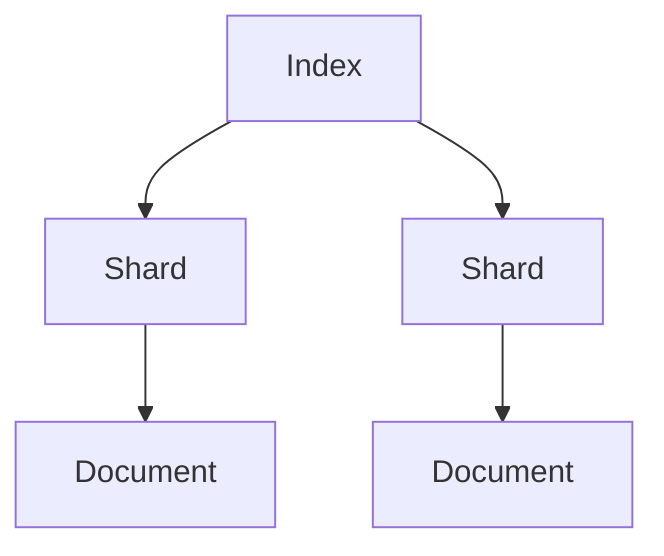
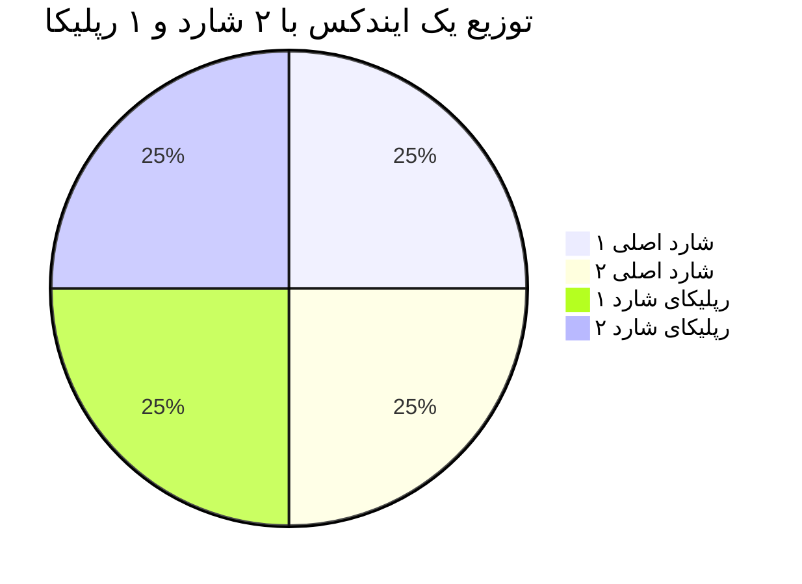

---

## 14. Apache Lucene: چی بود و چه کاری می‌کرد؟

**Apache Lucene** یه کتابخونه‌ی متن‌باز برای جستجوی متنیه که توسط Doug Cutting در سال ۱۹۹۹ ساخته شد. Lucene مثل یه موتور جستجوی قدرتمنده که می‌تونه توی متن‌ها بگرده و نتایج رو سریع پیدا کنه.

### چه کاری می‌کرد؟
Lucene از یه تکنیک به اسم **inverted index** (فهرست معکوس) استفاده می‌کنه. فرض کنید یه کتاب دارید و می‌خواهید بفهمید کلمه‌ی "جنگ" توی کدوم صفحاته. به جای اینکه کل کتاب رو بخونید، Lucene یه فهرست درست می‌کنه که می‌گه "جنگ" توی صفحات ۵، ۱۰ و ۱۵ هست. اینطوری جستجو خیلی سریع می‌شه.

### ارتباطش با Elasticsearch چیه؟
Elasticsearch بر پایه‌ی Lucene ساخته شده. در واقع، Elasticsearch یه لایه‌ی بالاتر روی Lucene اضافه کرده که امکاناتی مثل توزیع‌شدگی، مقیاس‌پذیری و APIهای ساده رو فراهم می‌کنه. به عبارت دیگه، Lucene موتور جستجوی زیرساختیه و Elasticsearch یه سیستم کامل برای کار با داده‌های بزرگ.

### مثال ساده:
فرض کنید Lucene یه موتور ماشین باشه—قوی و کارآمد، ولی برای استفاده‌ی روزمره به بدنه و فرمان و صندلی نیاز داره. Elasticsearch همون ماشینه که موتور Lucene رو داره و آماده‌ی رانندگیه.


---


## 📜 مفاهیم پایه Elasticsearch

### ۱. سلسله مراتب داده‌ها


### ۲. ایندکس (Index)
- معادل **جدول** در دیتابیس‌های رابطه‌ای (اما هوشمندتر!)
- مثال: ایندکس `web-logs-2023.08` برای ذخیره لاگ‌های آگوست

### ۳. داکیومنت (Document)
- کوچکترین واحد اطلاعاتی در فرمت JSON
```json
{
  "timestamp": "2023-08-15T14:30:00Z",
  "message": "User login failed",
  "severity": "ERROR",
  "ip": "192.168.1.1"
}
```

### ۴. ایندکسینگ معکوس (Inverted Index)
- مثل **فهرست کتاب** عمل می‌کند:
  - در کتاب سنتی: صفحه → کلمات
  - در Elastic: کلمه → اسناد حاوی آن

**مثال**:
```
کلمه: "error"
اسناد: doc1, doc5, doc8
```

### ۵. شارد (Shard) و رپلیکا
- **شارد**: بخشی از ایندکس (برای توزیع داده)
- **رپلیکا**: کپی از شارد برای تحمل خطا



## 15. مفاهیم اولیه استک Elastic (الفبای Elastic)

### 📄 داکیومنت (Document)

یعنی یک رکورد از اطلاعات. مثال:

```json
{
  "user": "Ali",
  "action": "login",
  "timestamp": "2025-07-20T10:00:00"
}
```

### 📁 ایندکس (Index)

مثل یک جدول در دیتابیس رابطه‌ای. مجموعه‌ای از داکیومنت‌ها با ساختار مشابه. مثلاً: index به نام `logs-2025` مخصوص لاگ‌های امسال.

### 🔄 ایندکسینگ معکوس (Inverted Index)

برخلاف دیتابیس‌های سنتی که برای هر رکورد فیلد ذخیره می‌کنند، در ایندکس معکوس هر کلمه کلیدی را نگه می‌داریم و لیست داکیومنت‌هایی که آن را دارند.

مثال:

```
کلمه «login» در داکیومنت‌های 1، 3، 7 وجود دارد.
```

این باعث می‌شود جستجو بسیار سریع انجام شود.

### 🧩 شارد (Shard) و رپلیکا (Replica)

- **شارد**: برش‌های فیزیکی از یک ایندکس برای تقسیم بار و مقیاس‌پذیری.
- **رپلیکا**: نسخه‌های کپی شاردها برای تحمل خطا.

مثال:

```
ایندکس «logs» ← شامل 5 شارد اصلی + 1 رپلیکا برای هر شارد.
```

### ⚙️ نود (Node) و کلاستر (Cluster)

- **نود**: یک سرور که Elasticsearch روی آن اجرا می‌شود.
- **کلاستر**: مجموعه‌ای از نودها که با هم کار می‌کنند.

## 13. مفاهیم اولیه استک Elastic (الفبای Elastic)

حالا که کلیات رو فهمیدیم، بیایم الفبای Elasticsearch رو یاد بگیریم. این مفاهیم پایه‌ی کارن و توی اپیزودهای بعدی عمیق‌تر می‌شن.

### Document (داکیومنت)
- **چیه؟**: یه واحد داده توی Elastic که به صورت JSON ذخیره می‌شه. مثل یه برگه کاغذه که اطلاعات روش نوشته شده.
- **مثال ساده**: یه لاگ می‌تونه یه داکیومنت باشه:
  ```json
  {
    "time": "2025-07-20 10:00",
    "message": "صفحه باز شد",
    "user": "علی"
  }
  ```

### Index (ایندکس)
- **چیه؟**: یه مجموعه از داکیومنت‌ها که شبیه همن. مثل یه پوشه توی کمد که برگه‌های مشابه رو توش نگه می‌دارید.
- **مثال**: یه ایندکس به اسم `web-logs` می‌تونه همه‌ی لاگ‌های سایتتون رو نگه داره.

### Inverted Index (ایندکس معکوس)
- **چیه؟**: یه فهرست هوشمند که نشون می‌ده هر کلمه توی کدوم داکیومنت‌ها هست. این قلب جستجوی سریع Elasticه.
- **مثال**: اگه دو داکیومنت داشته باشیم:
  - داکیومنت ۱: "سریع و خوب"
  - داکیومنت ۲: "سریع و قوی"
  فهرست معکوس می‌گه: "سریع" توی داکیومنت ۱ و ۲ هست، "خوب" فقط توی ۱، و "قوی" فقط توی ۲.

### Shard (شارد)
- **چیه؟**: یه تکه از ایندکس که جداگانه ذخیره می‌شه. مثل اینه که یه پوشه‌ی بزرگ رو به چند بخش کوچیک تقسیم کنید.
- **چرا مهمه؟**: شارد‌ها باعث می‌شن داده‌ها توی چند سرور پخش بشن و کار سریع‌تر انجام بشه.
- **مثال**: اگه ایندکس `web-logs` شما ۱۰۰ گیگ داده داره، می‌تونید به ۵ شارد ۲۰ گیگی تقسیمش کنید.

### Replica (رپلیکا)
- **چیه؟**: یه کپی از شارد که جای دیگه نگه‌داری می‌شه. مثل اینه که از مدارک مهم‌تون یه نسخه‌ی پشتیبان داشته باشید.
- **چرا مهمه؟**: اگه یه سرور خراب بشه، رپلیکا وارد عمل می‌شه و کار ادامه پیدا می‌کنه.
- **مثال**: شارد ۱ توی سرور A هست، رپلیکاش توی سرور B.

### Node (نود)
- **چیه؟**: یه سرور یا ماشین توی Elastic که کار ذخیره و پردازش داده‌ها رو انجام می‌ده. مثل یه کارگر توی یه تیمه.
- **انواعش**: 
  - **Data Node**: داده‌ها رو نگه می‌داره.
  - **Master Node**: تیم رو مدیریت می‌کنه.
- **مثال**: اگه ۳ نود داشته باشید، داده‌ها بینشون پخش می‌شه.

### Cluster (کلاستر)
- **چیه؟**: یه گروه از نودها که با هم کار می‌کنن. مثل یه تیم کاری که همه باهم یه پروژه رو جلو می‌برن.
- **مثال**: یه کلاستر با ۵ نود می‌تونه ۱ ترابایت داده رو مدیریت کنه.

### Data Type (نوع داده)
- **چیه؟**: مشخص می‌کنه هر فیلد توی داکیومنت چه نوعیه. مثل اینه که بگید این ستون توی دفترچه‌تون عدد باشه یا متن.
- **انواع رایج**:
  - **text**: برای متن‌های بلند که می‌خواهید جستجو کنید (مثل "پیام خطا").
  - **keyword**: برای متن‌های کوتاه که دقیق باید پیدا بشن (مثل "کد کاربر").
  - **date**: برای تاریخ و ساعت.
  - **number**: برای اعداد.
- **مثال**: توی داکیومنت بالا، `time` یه date‌ـه و `message` یه text.

### Mapping (نقشه‌بندی)
- **چیه؟**: یه دستورالعمل که می‌گه هر فیلد توی ایندکس چه نوع داده‌ایه و چطور ذخیره بشه. مثل یه نقشه‌ی راه برای Elastic.
- **مثال**: می‌تونید بگید فیلد `message` به صورت text باشه و کلماتش جدا جدا ذخیره بشن برای جستجوی بهتر.

---


حالا که کلیات رو فهمیدیم، بیایم الفبای Elasticsearch رو یاد بگیریم. این مفاهیم پایه‌ی کارن و توی اپیزودهای بعدی عمیق‌تر می‌شن.

### Document (داکیومنت)
- **چیه؟**: یه واحد داده توی Elastic که به صورت JSON ذخیره می‌شه. مثل یه برگه کاغذه که اطلاعات روش نوشته شده.
- **مثال ساده**: یه لاگ می‌تونه یه داکیومنت باشه:
  ```json
  {
    "time": "2025-07-20 10:00",
    "message": "صفحه باز شد",
    "user": "علی"
  }
  ```

### Index (ایندکس)
- **چیه؟**: یه مجموعه از داکیومنت‌ها که شبیه همن. مثل یه پوشه توی کمد که برگه‌های مشابه رو توش نگه می‌دارید.
- **مثال**: یه ایندکس به اسم `web-logs` می‌تونه همه‌ی لاگ‌های سایتتون رو نگه داره.

### Inverted Index (ایندکس معکوس)
- **چیه؟**: یه فهرست هوشمند که نشون می‌ده هر کلمه توی کدوم داکیومنت‌ها هست. این قلب جستجوی سریع Elasticه.
- **مثال**: اگه دو داکیومنت داشته باشیم:
  - داکیومنت ۱: "سریع و خوب"
  - داکیومنت ۲: "سریع و قوی"
  فهرست معکوس می‌گه: "سریع" توی داکیومنت ۱ و ۲ هست، "خوب" فقط توی ۱، و "قوی" فقط توی ۲.

### Shard (شارد)
- **چیه؟**: یه تکه از ایندکس که جداگانه ذخیره می‌شه. مثل اینه که یه پوشه‌ی بزرگ رو به چند بخش کوچیک تقسیم کنید.
- **چرا مهمه؟**: شارد‌ها باعث می‌شن داده‌ها توی چند سرور پخش بشن و کار سریع‌تر انجام بشه.
- **مثال**: اگه ایندکس `web-logs` شما ۱۰۰ گیگ داده داره، می‌تونید به ۵ شاردascan ۵ گیگ داده رو به ۵ شارد ۲۰ گیگی تقسیمش کنید.

### Replica (رپلیکا)
- **چیه؟**: یه کپی از شارد که جای دیگه نگه‌داری می‌شه. مثل اینه که از مدارک مهم‌تون یه نسخه‌ی پشتیبان داشته باشید.
- **چرا مهمه؟**: اگه یه سرور خراب بشه، رپلیکا وارد عمل می‌شه و کار ادامه پیدا می‌کنه.
- **مثال**: شارد ۱ توی سرور A هست، رپلیکاش توی سرور B.

### Node (نود)
- **چیه؟**: یه سرور یا ماشین توی Elastic که کار ذخیره و پردازش داده‌ها رو انجام می‌ده. مثل یه کارگر توی یه تیمه.
- **انواعش**: 
  - **Data Node**: داده‌ها رو نگه می‌داره.
  - **Master Node**: تیم رو مدیریت می‌کنه.
- **مثال**: اگه ۳ نود داشته باشید، داده‌ها بینشون پخش می‌شه.

### Cluster (کلاستر)
- **چیه؟**: یه گروه از نودها که با هم کار می‌کنن. مثل یه تیم کاری که همه باهم یه پروژه رو جلو می‌برن.
- **مثال**: یه کلاستر با ۵ نود می‌تونه ۱ ترابایت داده رو مدیریت کنه.

### Data Type (نوع داده)
- **چیه؟**: مشخص می‌کنه هر فیلد توی داکیومنت چه نوعیه. مثل اینه که بگید این ستون توی دفترچه‌تون عدد باشه یا متن.
- **انواع رایج**:
  - **text**: برای متن‌های بلند که می‌خواهید جستجو کنید (مثل "پیام خطا").
  - **keyword**: برای متن‌های کوتاه که دقیق باید پیدا بشن (مثل "کد کاربر").
  - **date**: برای تاریخ و ساعت.
  - **number**: برای اعداد.
- **مثال**: توی داکیومنت بالا، `time` یه date‌ـه و `message` یه text.

### Mapping (نقشه‌بندی)
- **چیه؟**: یه دستورالعمل که می‌گه هر فیلد توی ایندکس چه نوع داده‌ایه و چطور ذخیره بشه. مثل یه نقشه‌ی راه برای Elastic.
- **مثال**: می‌تونید بگید فیلد `message` به صورت text باشه و کلماتش جدا جدا ذخیره بشن برای جستجوی بهتر.

---

## مفاهیم پایه Elasticsearch:

### ۱. سلسله مراتب داده:
```
Index (مثل یک دیتابیس) → Type (جدول - در نسخه‌های جدید حذف شد) → Document (رکورد) → Field (ستون)
```

**مثال عملی**:
```json
{
  "_index": "orders",
  "_id": "1",
  "_source": {
    "customer": "جان دو",
    "amount": 150.00,
    "products": ["لپ‌تاپ", "ماوس"]
  }
}
```

### ۲. ایندکس معکوس (Inverted Index):
مثل فهرست انتهای کتاب عمل می‌کند:

| کلمه    | سندها       |
|--------|------------|
| خطا    | 1, 3, 5    |
| Timeout| 2, 5       |

### ۳. Shard و Replica:
- **Shard**: پارتیشن‌های یک ایندکس (پخش کردن داده روی چند نود)
- **Replica**: کپی‌های اضافی برای تحمل خطا

**مثال**: اگر یک ایندکس با ۵ شارد اصلی و ۱ رپلیکا داشته باشید:
- داده روی ۵ شارد اصلی نوشته می‌شود
- از هر شارد یک کپی گرفته می‌شود
- در مجموع ۱۰ شارد (۵ اصلی + ۵ کپی)

### ۴. نودها (Nodes):
- **Data Node**: ذخیره داده
- **Master Node**: مدیریت خوشه
- **Ingest Node**: پردازش داده قبل از ذخیره

## Apache Lucene: موتور زیرین
- یک کتابخانه Java با قابلیت‌های:
  - Tokenization (تقسیم متن به کلمات)
  - تحلیل متن (مثل حذف حروف اضافه)
  - رتبه‌بندی نتایج (TF-IDF, BM25)

**مثال تحلیل متن**:
متن: "The quick brown fox"
پس از پردازش: ["quick", "brown", "fox"] (حذف کلمات بی‌معنی و stemming)

## چرا Elasticsearch از Lucene استفاده می‌کند؟
- به جای اختراع چرخ دوباره، روی لایه‌های بالاتر تمرکز کرده:
  - توزیع‌شدگی
  - API ساده
  - ابزارهای مدیریتی


